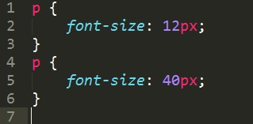

# CSS &ndash; kaskadowe arkusze stylów

## Zadanie 1.
Stwórz jeden **paragraf**, ustaw dla niego poniższe style i przetestuj ich działanie.



  Potrafisz wytłumaczyć rezultat?

## Zadanie 2.
Stwórz dwa **paragrafy** i ostyluj każdy w następujący sposób:
* pierwszemu ustaw wielkość fontu ```font-size: 20px```,
* drugiemu ustaw wielkość fontu ```font-size: 10px```.

## Zadanie 3.
Stwórz dwa **paragrafy** oraz jeden element **span** i wszystkim elementom ustaw tło w kolorze żółtym (```yellow```).

## Zadanie 4.
Stwórz jeden **div**. Wpisz do niego dowolny, krótki tekst. Nadaj elementowi klasę oraz identyfikator. Następnie w CSS ostyluj go w następujący sposób:


 Sprawdź, które tło zostanie przypisane elementowi **div**.

## Zadanie 5.
Wróć do paragrafu z zadania pierwszego. Wymuś na nim użycie pierwszego stylu (```font-size: 12px```) za pomocą słowa kluczowego ```!important```.
